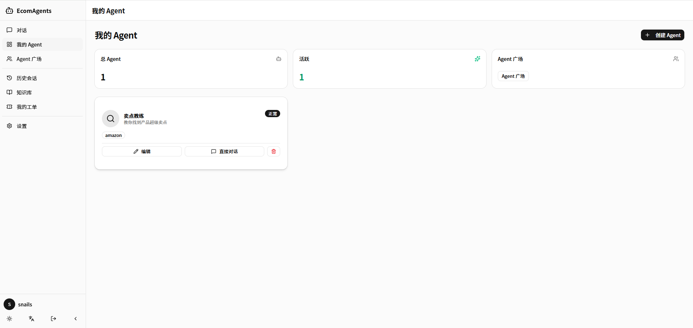

# EcomAgents — Enterprise E-commerce AI Agent Management Platform

[](https://adoptium.net/)
[](https://spring.io/projects/spring-boot)
[](https://vuejs.org/)
[](https://www.typescriptlang.org/)
[](https://www.postgresql.org/)
[](https://gradle.org/)
[]()

[](README.md)
[](README_EN.md)

---



A full-stack platform for managing, configuring, and interacting with AI agents in an e-commerce context. Built with [AgentScope Java SDK](https://java.agentscope.io/) for agent orchestration, featuring a Spring Boot backend and Vue 3 SPA frontend with shadcn-vue UI.

## Features

### 🤖 Agent Core

- **Agent Management** — Create, edit, and manage AI agents with system prompts, model assignment, greeting messages, tags, and multi-model failover
- **Ownership Isolation** — "My Agents" shows only agents created by the current user; "Agent Plaza" lists agents created by others (view and chat only, no editing)
- **SSE Real-time Chat** — Server-Sent Events streaming conversations with history browsing and session folder organization

### 🛠️ Tools & Extensions

- **Model Management** — Admin-configured LLM backends (OpenAI, DeepSeek, Qwen, Claude, Gemini, etc.) with per-model API keys, endpoints, and parameters
- **Tool Management** — Enable/disable and configure agent tools (web search, image generation, etc.) with per-tool JSON config and per-agent binding
- **Skill Management** — Filesystem-based skill system supporting GitHub URL import (git clone) and ZIP upload; skills stored in a global pool and copied per-agent on binding

### 📚 Knowledge Base

- **Document Management** — Admin-managed knowledge bases with document upload (TXT, MD, JSON), editing, and deletion
- **Vector Search** — PgVector full-text semantic retrieval with full operation audit trail
- **RAG Modes** — Supports **AGENTIC** (agent decides when to retrieve) and **GENERIC** (auto-inject context before each message)

### 🖼️ Media Generation

- **Image Generation** — Integrated gpt-image-2 model with text-to-image, style selection, and parameter tuning
- **Gallery** — Share generated images, view and like community works

### 💬 Social Collaboration

- **Group Chat** — Create groups, invite members, group conversations, file sharing, AI Agent collaboration
- **Private Messaging** — Peer-to-peer direct messages with file transfer support

### ⚙️ Platform Management

- **User Management** — Invite code registration, admin/user roles, JWT auth, user status control
- **Ticket System** — User-submitted tickets with admin processing, status transitions, and change records
- **System Logs** — Filterable operation audit logs by module, action type, and user
- **Token Usage** — Track and view token consumption across models, aggregated by model and user
- **i18n** — Chinese/English UI switching

## Tech Stack

### Backend (EcomAgents/)

| Component | Technology |
|-----------|-----------|
| Framework | Spring Boot 4.0.6 (Web, JPA, Security, Validation) |
| Language | Java 17 |
| Database | PostgreSQL 14+ (H2 for dev) |
| ORM | Hibernate 7 + Spring Data JPA |
| Auth | JWT (jjwt 0.12.6) + Spring Security |
| Agent Framework | [AgentScope Java SDK](https://java.agentscope.io/) 1.1.0-RC1 |
| Vector Search | PgVector (pgvector) |
| Image Generation | gpt-image-2 / DALL-E / Stable Diffusion |
| Build | Gradle |
| Testing | JUnit 5 + Mockito (70+ test classes) |

### Frontend (ShadcnAgentUI/)

| Component | Technology |
|-----------|-----------|
| Framework | Vue 3 (Composition API, `<script setup>`) |
| UI Library | shadcn-vue v2 (based on Reka UI) |
| Language | TypeScript (strict mode) |
| Build | Vite 8 |
| State Management | Pinia (composition stores) |
| Router | Vue Router 4 + navigation guards |
| HTTP Client | Axios (interceptors for token injection) |
| Testing | Vitest + happy-dom |
| Streaming | SSE via ReadableStream API |
| i18n | Vue I18n (Chinese/English) |
| Package Manager | pnpm (recommended) / npm |

## Project Structure

```
Agent/
├── EcomAgents/                          # ← Spring Boot backend (Java 17, Gradle, port 8888)
│   └── src/main/java/cafe/snails/ecomagents/
│       ├── config/                      # CORS, security, LLM config, AgentScope config
│       ├── controller/                  # REST controllers (25 controllers)
│       ├── dto/                         # Request/response DTOs (30+ DTOs)
│       ├── exception/                   # Global exception handler + error codes
│       ├── harness/                     # AgentScope HarnessAgent + SSE integration
│       ├── model/                       # JPA entities (30+ entities)
│       ├── repository/                  # Spring Data JPA repositories (25+)
│       ├── security/                    # JWT + Spring Security auth system
│       ├── service/                     # Business logic (25+ services)
│       │   └── rag/                     # RAG knowledge retrieval services
│       └── tool/                        # AgentScope @Tool annotated tools
├── ShadcnAgentUI/                       # ← Vue 3 SPA (TypeScript, Vite, shadcn-vue, port 5174)
│   └── src/
│       ├── api/                         # Axios HTTP client layer (17 API modules)
│       ├── components/                  # Business components + shadcn-vue UI
│       │   └── ui/                      # Button, Card, Dialog, Table, Badge, etc.
│       ├── constants/                   # Shared constants
│       ├── layouts/                     # DefaultLayout (sidebar) / BlankLayout (fullscreen)
│       ├── locales/                     # i18n (zh-CN / en)
│       ├── router/                      # Vue Router + navigation guards
│       ├── stores/                      # Pinia stores (auth/theme/agent/chat/knowledge/unread)
│       ├── types/                       # TypeScript type definitions
│       ├── utils/                       # Validation utilities
│       └── views/                       # Route-level page components
│           ├── admin/                   # ModelManage/SkillManage/TicketManage/TokenUsage/
│           │                            # ToolManage/UserManage — 6 management pages
│           ├── agent/                   # AgentList/AgentPlaza/AgentCreate
│           ├── chat/                    # DirectChatView — real-time streaming chat
│           ├── dashboard/               # DashboardView — system overview
│           ├── group/                   # GroupListView/GroupChatView — group chat
│           ├── history/                 # HistoryView — chat history
│           ├── image/                   # ImageGenerationView/GalleryView
│           ├── knowledge/               # KnowledgeBase
│           ├── log/                     # LogViewer — system audit log
│           ├── login/                   # Login
│           ├── message/                 # MessageListView/MessageChatView — private messages
│           ├── register/                # Register
│           ├── settings/                # SettingsView
│           └── ticket/                  # MyTickets
├── EcomAgentsFront/                     # ← Legacy Vue 3 + Naive UI (being replaced)
├── docs/
│   ├── adr/                             # Architecture Decision Records (5)
│   ├── architecture/                    # Architecture discussions
│   ├── image/                           # Screenshots
│   ├── prd/                             # Product requirement docs
│   └── superpowers/plans/               # Feature plans
├── back/                                # SQL dumps (24 tables)
├── io/                                  # AgentScope runtime artifacts
├── cli.bat                              # Claude CLI proxy tunnel launcher
├── CONTEXT.md                           # Domain model & architecture docs
├── REASONIX.md                          # Reasonix project memory
└── README.md / README_EN.md             # Project docs
```

## Quick Start

### Prerequisites

- Java 17+
- Node.js 18+
- PostgreSQL 14+
- Git (required for skill import)

### Backend Setup

```bash
cd EcomAgents

# Configure database in src/main/resources/application.properties
# Default: PostgreSQL at localhost:5432/ecomagents

# Run tests
./gradlew test

# Start development server (port 8888)
./gradlew bootRun
```

### Frontend Setup

```bash
cd ShadcnAgentUI

# Install dependencies (pnpm recommended, npm also works)
pnpm install
# npm install

# Run tests
pnpm test
# npm test

# Start development server (port 5174, proxies /v1 and /chat to backend :8888)
pnpm dev
# npm run dev

# Production build
pnpm build
# npm run build
```

### Default Admin Account

- Username: `admin`
- Password: `123456`

### Skill Import

Import skills directly from GitHub repositories (git clone):

```
https://github.com/{owner}/{repo}                              # Full scan
https://github.com/{owner}/{repo}/tree/main/skills/{name}      # Single skill
```

ZIP file upload is also supported. Skills are stored in a global pool and can be bound per-agent during creation or editing.

## API Endpoints

The frontend dev server proxies `/v1/*` and `/chat/*` requests to `http://localhost:8888`.

### Auth & Users

| Method | Path | Description |
|--------|------|-------------|
| POST | `/v1/login` | Login |
| POST | `/v1/register` | Register (requires invite code) |
| GET | `/v1/users` | List users (admin) |
| PATCH | `/v1/users/{id}/status` | Toggle user status (admin) |
| GET | `/v1/invite-codes` | List invite codes (admin) |
| POST | `/v1/invite-codes` | Generate invite code (admin) |

### Agents

| Method | Path | Description |
|--------|------|-------------|
| GET | `/v1/agents` | List agents (`?scope=my\|plaza`) |
| POST | `/v1/agents` | Create agent |
| GET | `/v1/agents/{id}` | Get agent details |
| PUT | `/v1/agents/{id}` | Update agent |
| DELETE | `/v1/agents/{id}` | Delete agent |
| GET | `/v1/agents/{id}/skills` | Get agent bound skills |
| POST | `/v1/agents/{id}/skills` | Bind skill to agent |
| DELETE | `/v1/agents/{id}/skills/{name}` | Unbind skill from agent |

### Chat & Sessions

| Method | Path | Description |
|--------|------|-------------|
| POST | `/v1/chat/{agentId}/stream` | SSE streaming chat |
| GET | `/v1/sessions` | List sessions (with folder tree) |
| POST | `/v1/sessions` | Create session |
| GET | `/v1/sessions/{id}` | Session details |
| DELETE | `/v1/sessions/{id}` | Delete session |
| GET | `/v1/session-folders` | List session folders |
| POST | `/v1/session-folders` | Create folder |
| PUT | `/v1/session-folders/{id}` | Update folder |
| DELETE | `/v1/session-folders/{id}` | Delete folder |

### Model Management (Admin)

| Method | Path | Description |
|--------|------|-------------|
| GET | `/v1/models` | List models |
| POST | `/v1/models` | Create model |
| PUT | `/v1/models/{id}` | Update model |
| DELETE | `/v1/models/{id}` | Delete model |

### Tool Management (Admin)

| Method | Path | Description |
|--------|------|-------------|
| GET | `/v1/tools` | List tools |
| PUT | `/v1/tools/{id}` | Update tool |
| PATCH | `/v1/tools/{id}/toggle` | Toggle tool enabled |
| POST | `/v1/tools/{id}/config` | Save tool config |

### Skills

| Method | Path | Description |
|--------|------|-------------|
| GET | `/v1/skills` | List skills |
| POST | `/v1/skills/import-url` | Import from GitHub URL |
| POST | `/v1/skills/upload` | Upload skill ZIP |
| DELETE | `/v1/skills/{name}?force=false` | Delete skill |

### Knowledge Base

| Method | Path | Description |
|--------|------|-------------|
| GET | `/v1/knowledge-bases` | List knowledge bases |
| POST | `/v1/knowledge-bases` | Create (admin) |
| DELETE | `/v1/knowledge-bases/{id}` | Delete (admin) |
| GET | `/v1/knowledge-bases/{kbId}/audit-logs` | Audit logs |
| POST | `/v1/knowledge-bases/{kbId}/documents` | Upload document |
| PUT | `/v1/knowledge-bases/{kbId}/documents/{docId}` | Update document |
| DELETE | `/v1/knowledge-bases/{kbId}/documents/{docId}` | Delete document |

### Image Generation & Gallery

| Method | Path | Description |
|--------|------|-------------|
| POST | `/v1/image/generate` | Request image generation |
| GET | `/v1/image/history` | Generation history |
| GET | `/v1/gallery/items` | Gallery items |
| POST | `/v1/gallery/items` | Publish to gallery |
| DELETE | `/v1/gallery/items/{id}` | Delete gallery item |
| POST | `/v1/gallery/items/{id}/like` | Toggle like |

### Group Chat

| Method | Path | Description |
|--------|------|-------------|
| GET | `/v1/groups` | My groups |
| POST | `/v1/groups` | Create group |
| PUT | `/v1/groups/{id}` | Update group |
| DELETE | `/v1/groups/{id}` | Delete group |
| GET | `/v1/groups/{id}/members` | List members |
| POST | `/v1/groups/{id}/members` | Add member |
| DELETE | `/v1/groups/{id}/members/{userId}` | Remove member |
| GET | `/v1/groups/{id}/messages` | Message history |
| POST | `/v1/groups/{id}/messages` | Send message |
| GET | `/v1/groups/{id}/files` | List files |
| POST | `/v1/groups/{id}/files` | Upload file |
| DELETE | `/v1/groups/{id}/files/{fileId}` | Delete file |
| GET | `/v1/groups/{id}/agents` | Group AI agents |

### Private Messages

| Method | Path | Description |
|--------|------|-------------|
| GET | `/v1/private-messages/contacts` | Contact list |
| GET | `/v1/private-messages/{userId}` | Message history |
| POST | `/v1/private-messages/{userId}` | Send message |
| POST | `/v1/private-messages/upload` | Upload file |

### Tickets

| Method | Path | Description |
|--------|------|-------------|
| GET | `/v1/tickets` | List tickets |
| POST | `/v1/tickets` | Create ticket |
| PUT | `/v1/tickets/{id}` | Update ticket |
| GET | `/v1/tickets/{id}` | Ticket details |
| POST | `/v1/tickets/{id}/handle` | Handle ticket (admin) |

### System Management

| Method | Path | Description |
|--------|------|-------------|
| GET | `/v1/system-logs` | System operation logs (admin) |
| GET | `/v1/token-usage` | Token usage statistics |
| GET | `/v1/files/upload` | File upload |
| GET | `/v1/emoji` | Emoji list |

## Multi-Tenant Architecture

The platform supports multiple users interacting with the same agent. Data isolation strategy:

| Layer | Isolation | Implementation |
|-------|-----------|---------------|
| Agent personality (AGENTS.md) | Per-agent | Each agent has independent workspace: `EcomAgents/workspace/agent-{id}/` |
| Session metadata | Per-user | DB `sessions` table records userId |
| Session messages | Per-user | DB `session_messages` table linked via session FK |
| Session files (JSONL) | Per-user traceable | Session ID format: `sess-{agentId}-{userId}-{uuid}` |
| Long-term memory (MEMORY.md) | **Shared per-agent** | AgentScope SDK limitation — all users share the same MEMORY.md |

> Long-term memory sharing is a known framework limitation (`MemoryFlushHook` hardcodes
> the path to workspace root). Session-level data remains strictly isolated.
> See [CONTEXT.md](./CONTEXT.md) for details.

## Project Conventions

- **Backend**: RESTful controllers at `/v1/*`, JPA entities with Lombok, service-layer business logic, global exception handling
- **Frontend**: Composition API `<script setup>` style, shadcn-vue v2 components, Pinia composition stores, strict TypeScript (`noUnusedLocals` + `noUnusedParameters`)
- **Access Control**: Dual guard via Vue Router `beforeEach` + `JwtAuthenticationFilter`; admin/user role separation
- **Agent Ownership**: Users can only modify agents they created; "Agent Plaza" allows using others' agents for conversation
- **Skills**: Global skill pool stored in `workspace/skills/{name}/SKILL.md` with YAML frontmatter; copied per-agent on binding
- **Knowledge Base**: Admin-managed lifecycle with PgVector vector search and full operation audit trail
- **i18n**: Runtime-switchable Chinese/English via Vue I18n, language preference persisted in Pinia store
- **Code Index**: [CodeGraph](https://github.com/getcodegraph/codegraph) MCP service configured for symbol search, call chain analysis, and impact assessment

## License

MIT
